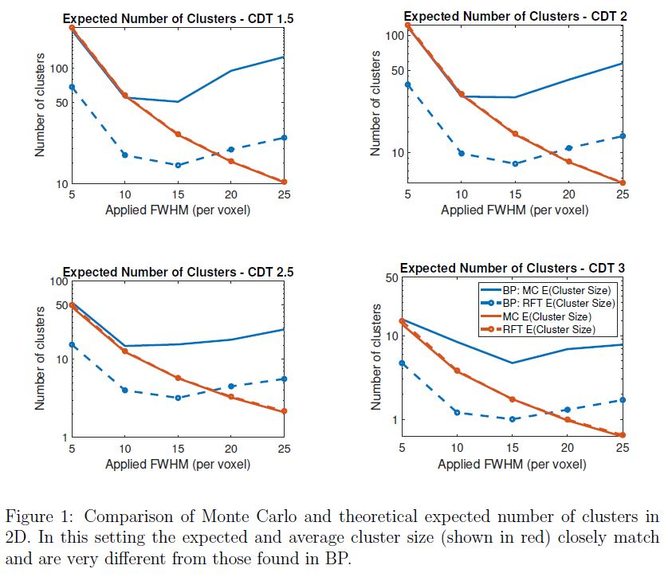
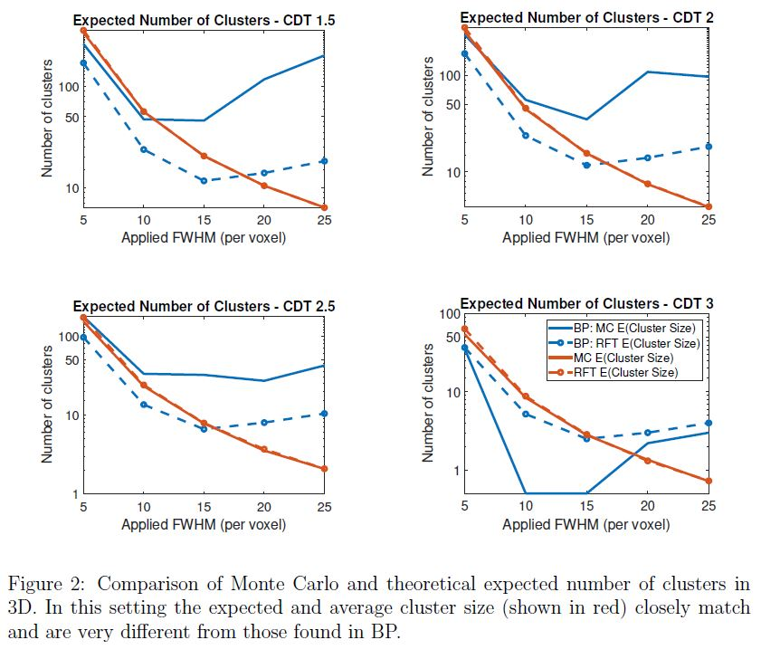

# Code for our response article to Bansal and Peterson (2018)
## Overview of the problem
The use of Random Field Theory (RFT) to control the false positive rate in neuroimaging
is a well established testing framework.  In a recent manuscript, [Bansal and Peterson (2018)](https://www.ncbi.nlm.nih.gov/pmc/articles/PMC5991838/)
found that in simple Gaussian simulations RFT incorrectly estimates the number of clusters
of a Gaussian field that lie above a threshold. However, these results contradict the
existing literature and our own previous findings, and exhibited highly counter-intuitive
features. Unfortunately this implies that a number of their conclusions regarding the performance of RFT are
invalid.

The purpose of this repository is to provide freely available and reproducible
code the evaluations considered by Bansal and Peterson (2018); showing simulation and theory align in line with the standard literature. Our results
show that in these simulations the expected Euler characteristic closely
matches the average number of clusters as predicted by theory. Unfortunately it appears
that Bansal and Peterson (2018) have miscalculated the Euler characteristics and have simulated their random
fields incorrectly. Unfortunately this implies that their conclusions regarding the performance of RFT are
invalid. See our response article HERE for full details.

To run the code in this repo you will need to have MATLAB and to install the [RFTtoolbox](https://github.com/sjdavenport/RFTtoolbox/) - A MATLAB toolbox designed for generation and analysis of random fields both continuously sampled and on a lattice.
In addition, SPM12 must be installed in order for the 3D LKC estimation (performed using SPM)
to work.

## Comparing their results and ours

These figures compare out results with those obtained in Bansal and Peterson (2018) (which is denoted as BP in the plots). The figures demonstrate that in these simulation settings RFT provides a close estimate of the expected number of clusters (at all applied smoothness levels) contradicting their findings.

